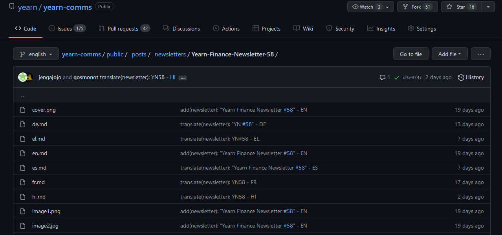

# Contributor's guide to Github

##### Option #1.a (editing a single file from the Github website)
You can follow this method for translating one piece of content at a time.

- [1. Adding a new file](#adding-a-new-file)
- [2. Creating a pull request](#creating-a-pull-request)

##### Option #1.b - *continued* (editing multiple files from the Github website)
You can follow this method for editing multiple files at once (such as when adding files, editing typos across multiple files, translation checking and updates after publication, formatting and fixing errors, duplicates etc...)

- [3. Editing your PR branch](#editing-your-pr-branch)

##### Option #2 (creating a fork of the repository)

You can follow this alternative method for your translations, and it is recommended you follow this method for editing multiple files at once (such as when adding files, editing typos across multiple files, translation checking and updates after publication, formatting and fixing errors, duplicates etc...)

- [1. Forking the comms repository](#forking-the-comms-repository)
- [2. Creating a new branch in your repository](#creating-a-new-branch-in-your-repository)
- [3. Deleting your branch](#deleting-your-branch)

---

## Option #1.a (editing files from the Github website)

You can follow this method for translating one piece of content at a time.

### Adding a new file

This allows you to propose changes to the upstream, or original, repository. 

1. On Github.com, navigate to the main [yearn/yearn-comms](https://github.com/yearn/yearn-comms) repository

2. Navigate to the folder of the content you want to translate (All the articles, announcements, newletters and tweets are stored in the `public/_posts` folder.)

3. Inside the folder of the content you want to translate, you will find the original content file (`en.md`), possibly media files (here `cover.png`, `image1.png`,...)

4. On the top right, click `Add file`, then `Create new file`

You will be notified that this has created a new branch for you.

5. Name your new file `<locale>.md`, with your language. The supported name files are :   
  > `en.md`, `fr.md`, `es.md`, `de.md`, `pt.md`, `el.md`, `tr.md`, `vi.md`, `zh.md`, `hi.md`, `ja.md`, `ru.md` 

6. Copy and paste en content of the `en.md` file in the body, as a base for the layout of the post, and translate its content. You can get the content from the  `en.md` in the right format by viewing it in plain text:

7. Within the front matter, at the top of each post:
	- Contributors should translate the `title:` field in the header of the article
	- Contributors should fill the `translator:` field with their name/tag

---

### Creating a pull request

8. Once you have completed your edits/translation, you need to"commit" your changes. You can find a button to do just that at the bottom of the page. Please write a meaningful commit title, and click on `Propose new file`.

9. You can now propose this to the main repository. You are able to propose a merge of your newly created temporary branch (here `dastronom:patch-100`) to the main repository (here `yearn-comms:english`).

Check that your commit is proper, and click on `Create pull request`.

Your edit has now been pushed to the main repository and will be reviewed before being merged. It will not appear under the "Pull requests" tab of the main repository.

---

## Option #1.b - *continued* (editing files from the Github website)

If you need to edit more files and would like to keep it within the same PR (such as when adding files, editing typos across multiple files, translation checking and updates after publication, formatting and fixing errors, duplicates etc...).

### Editing your PR branch

10. From the "Pull requests" tab under the main repository, click on the PR you want to edit/add to:

11. From within your PR, under the name of the PR, you can find the temporary branch that was created for you for these edits. Click on the link to your branch.

12. You should now be back in your own repository, on a fork of the yearn-comms repository, and in the temporary branch, here "patch-31".

13. Any edits you do and commit within this branch will be automatically joined to the PR that this "patch" branch corresponds to. You can check the PR again and you will see the list of commits that the PR covers !

---

## Option #2 (creating a fork of the repository)

You can follow this method for your translations, and it is recommended you follow this method for editing multiple files at once (such as when editing typos across multiple files, translation checking and updates after publication, formatting and fixing errors, duplicates etc...)

---

### Forking the comms repository

This allows you to propose changes to the upstream, or original, repository. 

1. On Github.com, navigate to the main [yearn/yearn-comms](https://github.com/yearn/yearn-comms) repository

2. On the top right of the page, click `Fork`, to fork the project (*this will create a copy of a repository, under your account. Forking a repository allows you to freely experiment with changes without affecting the original project.*)

3. Fork yearn-comms: 

> Where should we fork yearn-comms?

Select your Github `username`. The fork will be created as `username/yearn-comms`.

4. You should now have a forked repository under your username on Github.com, such as:

5. As the main (upstream) repository develops, your fork will fall behind and out of sync. You can read a message that indicates that, stating: 

> This branch is x commit(s) behind yearn/yearn-comms:english

(*In this repository, all live content is located within the "english" branch*)

Before making edits to the files in your fork, please make sure to sync the main branch of your fork (here english branch) with the main repository by clicking `Fetch upstream`, then `Fetch and Merge`.

Once the sync is done (after a few seconds), you should see a message stating that your branch is up to date.

---

### Creating a new branch in your repository

Once your main branch (english) is up to date with yearn/yearn-comms:english, you can create a new branch where you will do your edits.

Please create a branch for each PR that you plan on doing. That is, a separate branch for each translation. You can for example name each per the article you are working on `newsletter58`.

For typos, or small edits on multiple files, please create a single branch and edit all on the same branch (ie. new branch name: `fix-edits`)

1. Click on the `english` branch, then write the new branch name you would liek to call it, and click on `Create branch: [branch_name] from english`.

2. You should now see your newly create branch. You will want to make sure you are on the correct branch, and you can start making your edits.

3. Once you are done with your edits and have committed them, you should see that your branch is now "x commits ahead" of the main repository (yearn/yearn-comms:english). When you are ready, you can click on `Compare & pull request` to send a PR to the main repository.

4. Here you can see that you are asking to merge your new branch (here branch "newsletter58" in qosmonot's repository) to the base repository (yearn-comms, english branch).

Go ahead and fill out a meaningful **PR title**, **PR description**, then click on `Create pull request`

---

### Deleting your branch

Once your PR has been approved, you no longer need to maintain the branch that was used to create it, and you are free to delete the branch.

Once more, click on your current branch, then `View all branches`

and delete from here any branch that you had created for your edits:

Voila!
